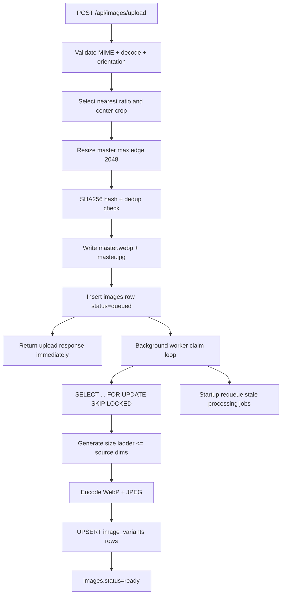

# Responsive Image Pipeline (Revised Plan)

## Locked decisions

1. Legacy `/api/images/:hash?size=*` URLs are not preserved.
2. UI fallback favors reliability: always show a real image URL (master) or a visual placeholder, never an empty `img src`.
3. Background processing must be durable (DB-backed claim/retry/recovery), not fire-and-forget goroutines.

---

## Current vs target

| Aspect     | Current                   | Target                                      |
| ---------- | ------------------------- | ------------------------------------------- |
| Variants   | 3 (200/800/1920)          | 5 (256/640/1080/1440/2048) + master         |
| Formats    | JPEG/PNG                  | WebP primary + JPEG fallback                |
| Aspect     | Raw                       | Auto-crop to 1:1 / 4:5 / 1.91:1             |
| Processing | Upload-thread synchronous | Queue + durable worker                      |
| Serving    | Go `/api/images/:hash`    | Nginx-first `/media/i/<hash>/<file>`        |
| Frontend   | Single ``            | `<picture>` with `srcset` and safe fallback |

---

## Architecture overview



---

## Phase 1: Docker + dependency changes

### Docker updates

- `Dockerfile`: switch final runtime to alpine, enable CGO in build, install `libwebp-dev` in builder and `libwebp` in runtime. All stages (dev, test, production) now reside in this single file.

### Go dependency

- Add `github.com/chai2010/webp` to `backend/go.mod`.

### Compose/env cleanup

- Remove `DISTROLESS_IMAGE` build arg from `compose.yml`.
- No new env var required for this phase.

---

## Phase 2: DB migration (000004)

### New file: `backend/internal/database/migrations/000004_image_variants.up.sql`

```sql
ALTER TABLE images
  ADD COLUMN IF NOT EXISTS status VARCHAR(20) NOT NULL DEFAULT 'queued',
  ADD COLUMN IF NOT EXISTS blurhash VARCHAR(83),
  ADD COLUMN IF NOT EXISTS error TEXT,
  ADD COLUMN IF NOT EXISTS crop_mode VARCHAR(20) NOT NULL DEFAULT 'free',
  ADD COLUMN IF NOT EXISTS crop_x INT NOT NULL DEFAULT 0,
  ADD COLUMN IF NOT EXISTS crop_y INT NOT NULL DEFAULT 0,
  ADD COLUMN IF NOT EXISTS crop_w INT NOT NULL DEFAULT 0,
  ADD COLUMN IF NOT EXISTS crop_h INT NOT NULL DEFAULT 0,
  ADD COLUMN IF NOT EXISTS processing_started_at TIMESTAMPTZ,
  ADD COLUMN IF NOT EXISTS processing_attempts INT NOT NULL DEFAULT 0;

CREATE INDEX IF NOT EXISTS idx_images_status ON images(status);

CREATE TABLE IF NOT EXISTS image_variants (
  id         BIGSERIAL PRIMARY KEY,
  image_id   BIGINT NOT NULL REFERENCES images(id) ON DELETE CASCADE,
  size_name  VARCHAR(20) NOT NULL,   -- thumb/sm/md/lg/xl
  size_px    INT NOT NULL,           -- 256/640/1080/1440/2048
  format     VARCHAR(10) NOT NULL,   -- webp/jpg
  path       VARCHAR(512) NOT NULL,
  width      INT NOT NULL,
  height     INT NOT NULL,
  bytes      BIGINT NOT NULL,
  created_at TIMESTAMPTZ NOT NULL DEFAULT NOW(),
  CONSTRAINT uq_variant UNIQUE (image_id, size_px, format)
);

CREATE INDEX IF NOT EXISTS idx_image_variants_image_id ON image_variants(image_id);

ALTER TABLE posts
  ADD COLUMN IF NOT EXISTS image_hash VARCHAR(64);

CREATE INDEX IF NOT EXISTS idx_posts_image_hash ON posts(image_hash);
```

### New file: `backend/internal/database/migrations/000004_image_variants.down.sql`

```sql
DROP INDEX IF EXISTS idx_posts_image_hash;
ALTER TABLE posts DROP COLUMN IF EXISTS image_hash;

DROP INDEX IF EXISTS idx_image_variants_image_id;
DROP TABLE IF EXISTS image_variants;

DROP INDEX IF EXISTS idx_images_status;
ALTER TABLE images
  DROP COLUMN IF EXISTS status,
  DROP COLUMN IF EXISTS blurhash,
  DROP COLUMN IF EXISTS error,
  DROP COLUMN IF EXISTS crop_mode,
  DROP COLUMN IF EXISTS crop_x,
  DROP COLUMN IF EXISTS crop_y,
  DROP COLUMN IF EXISTS crop_w,
  DROP COLUMN IF EXISTS crop_h,
  DROP COLUMN IF EXISTS processing_started_at,
  DROP COLUMN IF EXISTS processing_attempts;
```

---

## Phase 3: Models + repository contracts

### Model updates

- `backend/internal/models/image.go`
  - Add `Status`, `Blurhash`, `Error`, crop fields, `ProcessingStartedAt`, `ProcessingAttempts`.
  - Add `Variants []ImageVariant`.
- `backend/internal/models/image_variant.go`
  - New model for per-size/per-format outputs.
- `backend/internal/models/post.go`
  - Add `ImageHash string` (persisted, indexed).
  - Add non-persisted API fields:
    - `ImageVariants map[string]string gorm:"-" json:"image_variants,omitempty"`
    - `ImageCropMode string gorm:"-" json:"image_crop_mode,omitempty"`

### Repository updates

- `backend/internal/repository/image.go`:
  - Add `ClaimNextQueued`, `MarkProcessing`, `MarkReady`, `MarkFailed`.
  - Add `RequeueStaleProcessing(timeout)`.
  - Add `UpsertVariant`.
  - Add `GetByHashWithVariants`.
- `backend/internal/repository/post.go`:
  - Fill `image_variants` + `image_crop_mode` via join/preload path keyed by `posts.image_hash` (no handler-level N+1 loop).

### Registry update

- Register `models.ImageVariant` in `backend/internal/database/models_registry.go`.

---

## Phase 4: Processing pipeline (durable)

### Constants

- Master max edge: `2048`
- Variant ladder: `256, 640, 1080, 1440, 2048`
- Quality: WebP `70`, JPEG `82`
- Ratios: `1.91`, `1.0`, `0.8`

### Upload flow

1. Validate bytes, MIME, decoded format.
2. Auto-orient and strip metadata via decode/re-encode pipeline.
3. Auto-crop to nearest allowed ratio.
4. Resize to master (max 2048 edge).
5. Encode master JPEG and compute hash for dedup.
6. Write `master.webp` + `master.jpg` under `/var/sanctum/uploads/images/<hash>/`.
7. Insert image DB row with `status="queued"` + crop metadata.
8. Return response immediately with:
   - `url: "/media/i/<hash>/master.jpg"` (always valid immediately)
   - `status: "queued"`
   - empty or partial `variants`

### Worker flow

1. Start worker loop at server startup.
2. On startup, requeue stale rows:
   - `status='processing' AND processing_started_at < now() - interval '15 minutes'`.
3. Claim jobs atomically using `FOR UPDATE SKIP LOCKED`.
4. Mark `processing`, increment `processing_attempts`, set `processing_started_at`.
5. Generate variants for sizes `<= master dimensions` (no upscaling).
6. Encode WebP/JPEG, write files, UPSERT `image_variants`.
7. Mark `ready` on success.
8. Mark `failed` + error text on failure.

This design survives process restarts and supports horizontal scaling safely.

---

## Phase 5: API routes and contract

### Route strategy

- Keep:
  - `POST /api/images/upload` (protected)
  - `GET /api/images/:hash/status` (public)
- Remove legacy compatibility requirement for:
  - `GET /api/images/:hash?size=*`

### Upload response

```go
type ImageUploadResponse struct {
  ID        uint              `json:"id"`
  Hash      string            `json:"hash"`
  Status    string            `json:"status"` // queued|processing|ready|failed
  Width     int               `json:"width"`
  Height    int               `json:"height"`
  CropMode  string            `json:"crop_mode"`
  SizeBytes int64             `json:"size_bytes"`
  MimeType  string            `json:"mime_type"`
  URL       string            `json:"url"`     // /media/i/<hash>/master.jpg
  Variants  map[string]string `json:"variants"`// e.g. "640_webp":"/media/i/<hash>/640.webp"
}
```

### Status endpoint

```json
{
  "status": "ready",
  "crop_mode": "landscape",
  "variants": {
    "256_webp": "/media/i/<hash>/256.webp",
    "256_jpg": "/media/i/<hash>/256.jpg"
  }
}
```

### Post persistence wiring

- On post create/update, derive and store `posts.image_hash` from `/media/i/<hash>/...`.
- Feed/detail APIs include `image_variants` + `image_crop_mode` when `image_hash` is present.

---

## Phase 6: Nginx + compose

### Compose

- `compose.yml`: mount uploads volume into frontend container read-only.
- `compose.override.yml`: keep upload directory mounted for local development parity.

### `frontend/nginx.conf`

Add `/media/i/` block before `/api/`:

```nginx
location /media/i/ {
  alias /var/sanctum/uploads/images/;
  add_header Cache-Control "public, max-age=31536000, immutable";
  add_header X-Content-Type-Options "nosniff";
  try_files $request_filename =404;

  types {
    image/webp webp;
    image/jpeg jpg jpeg;
  }
  default_type application/octet-stream;
}
```

Note: use `$request_filename` with `alias`; `$uri` here can produce false 404s.

---

## Phase 7: Frontend `<picture>` + robust fallback UI

### Types

- Update `frontend/src/api/types.ts`:
  - `UploadedImage`: add `status`, `crop_mode`, `variants`, keep `url`.
  - `Post`: add `image_variants?`, `image_crop_mode?`.

### New component

- Create `frontend/src/components/posts/ResponsiveImage.tsx`.
- Behavior:
  - If variants are present, render `<picture>`:
    - `<source type="image/webp" srcSet="...">`
    - ``
  - If variants are missing (queued/processing), render `fallbackUrl` (master URL).
  - If both are missing, render a bounded placeholder shell (no broken icon, no empty `src`).
  - Aspect ratio class is derived from `cropMode`.

### Page usage

- Replace image blocks in:
  - `frontend/src/pages/Posts.tsx`
  - `frontend/src/pages/PostDetail.tsx`
- Keep using `uploaded.url` after upload; it points to `master.jpg` and is immediately valid.

### URL normalization

- Update `frontend/src/lib/mediaUrl.ts` to keep `/media/i/` URLs relative, same as `/api/...`.

---

## Phase 8: Validation and tests

1. `docker compose build` passes with CGO + libwebp in all required images.
2. `make dev` applies migration `000004` cleanly.
3. Upload landscape/portrait/square images and verify `crop_mode`.
4. Confirm master files exist immediately after upload response.
5. Confirm worker eventually creates expected variants (up to source size; no upscaling).
6. Confirm stale in-flight jobs are requeued on restart.
7. `curl /media/i/<hash>/1080.webp` returns image + immutable cache header (when that size exists).
8. Frontend feed/detail choose WebP when supported and select size via `srcset`.
9. Processing state UI shows fallback master image or placeholder, never broken image icon.
10. `make test-backend` and `make test-frontend` pass.
11. Run OpenAPI flow (`make swagger`, `make openapi-check`) after API contract changes.

---

## Files to create

| File                                                                  | Purpose                                             |
| --------------------------------------------------------------------- | --------------------------------------------------- |
| `backend/internal/database/migrations/000004_image_variants.up.sql`   | Schema changes for image pipeline + post image hash |
| `backend/internal/database/migrations/000004_image_variants.down.sql` | Rollback                                            |
| `backend/internal/models/image_variant.go`                            | ImageVariant model                                  |
| `frontend/src/components/posts/ResponsiveImage.tsx`                   | Responsive image renderer                           |

## Files to modify

| File                                           | Changes                                            |
| ---------------------------------------------- | -------------------------------------------------- |
| `Dockerfile`                                   | CGO + libwebp build/runtime                        |
| `Dockerfile`                                   | libwebp-dev for all builds (multi-stage)          |
| `frontend/Dockerfile`                          | deps, dev, build, production stages                |
| `compose.yml`                                  | remove distroless arg, mount uploads into frontend |
| `compose.override.yml`                         | uploads mount for dev parity                       |
| `backend/go.mod`                               | add `github.com/chai2010/webp`                     |
| `backend/internal/models/image.go`             | status/crop/processing fields + relation           |
| `backend/internal/models/post.go`              | `image_hash` + response-only variant fields        |
| `backend/internal/repository/image.go`         | claim/process/status/variant methods               |
| `backend/internal/repository/post.go`          | enrich posts with image variants/crop mode         |
| `backend/internal/service/image_service.go`    | master+variant pipeline + durable worker           |
| `backend/internal/server/image_handlers.go`    | new upload/status response contract                |
| `backend/internal/server/server.go`            | route changes                                      |
| `backend/internal/database/models_registry.go` | register `ImageVariant`                            |
| `frontend/nginx.conf`                          | `/media/i/` direct serving                         |
| `frontend/src/api/types.ts`                    | new image/post fields                              |
| `frontend/src/pages/Posts.tsx`                 | use `ResponsiveImage`                              |
| `frontend/src/pages/PostDetail.tsx`            | use `ResponsiveImage`                              |
| `frontend/src/lib/mediaUrl.ts`                 | normalize `/media/i/` paths                        |
| `backend/docs/swagger.yaml`                    | API contract updates                               |
| `backend/docs/swagger.json`                    | generated output                                   |
| `backend/docs/docs.go`                         | generated output                                   |
